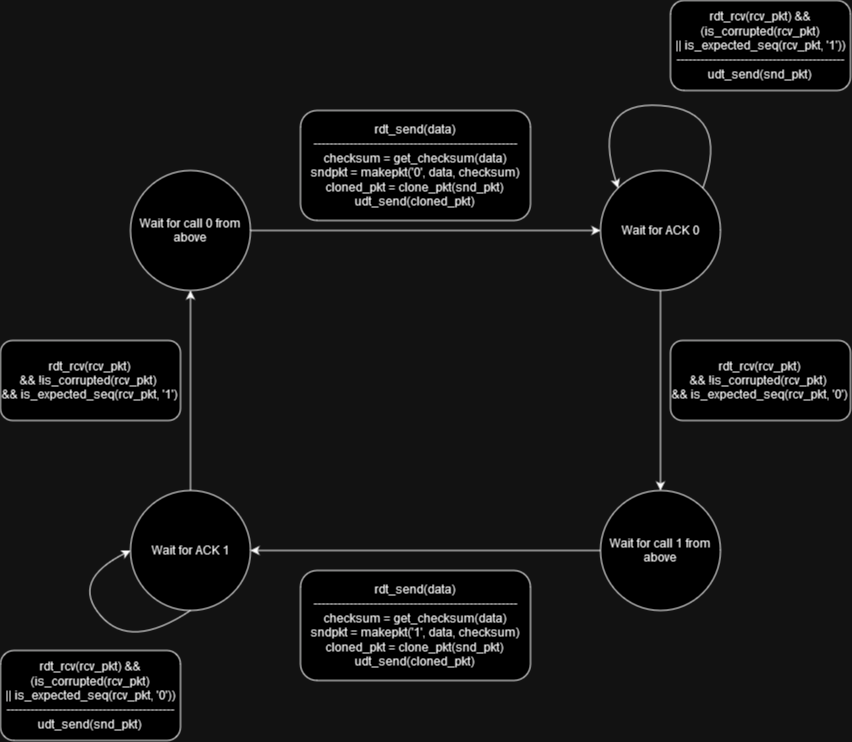
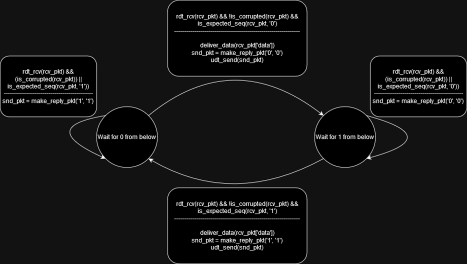

# RDT-v2.2-protocol

Reliable Data Transfer Protocol (RDT) 2.2 Implementation
This project is a Python implementation of the Reliable Data Transfer Protocol (RDT) version 2.2. It simulates the sending of a message from a sender to a receiver over a network with a specified reliability and delay.

## Protocol Design

Finite State Machine of the sender side of RDT-2.2

Finite State Machine of the receiver side of RDT-2.2

## Project Structure
The project is structured into several Python files, each representing a different component of the system:

main.py: The entry point of the application. It sets up the network layer, sender, and receiver processes, and initiates the sending of a message from the sender to the receiver.

network.py: Contains the NetworkLayer class, which simulates the network layer in the OSI model. It provides methods for sending and receiving packets, with the possibility of packet corruption and delay to simulate real-world network conditions.

receiver.py: Contains two classes: ReceiverProcess and RDTReceiver. ReceiverProcess represents the receiver process in the application layer, and RDTReceiver implements the receiver side of the RDT protocol.

sender.py: Contains two classes: SenderProcess and RDTSender. SenderProcess represents the sender process in the application layer, and RDTSender implements the sender side of the RDT protocol.

## How it Works
The sender sends a message, which is broken down into packets and sent over the network. The receiver receives the packets, checks them for errors, and sends acknowledgments back to the sender. The sender then waits for these acknowledgments before sending the next packet. If a packet is corrupted or lost, the sender resends it.

## Debug Mode
The project also includes a debug mode, which allows you to control whether packets and acknowledgments are corrupted. This can be useful for testing the robustness of the RDT protocol implementation.
